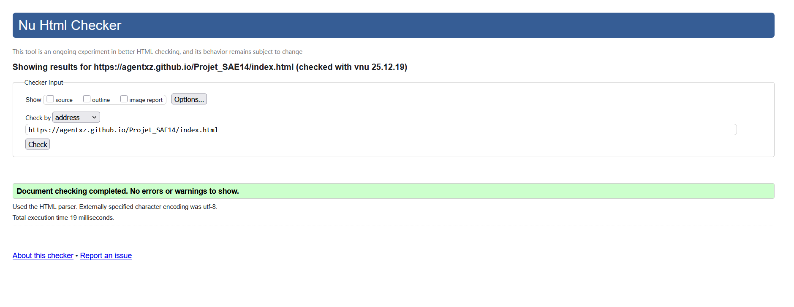
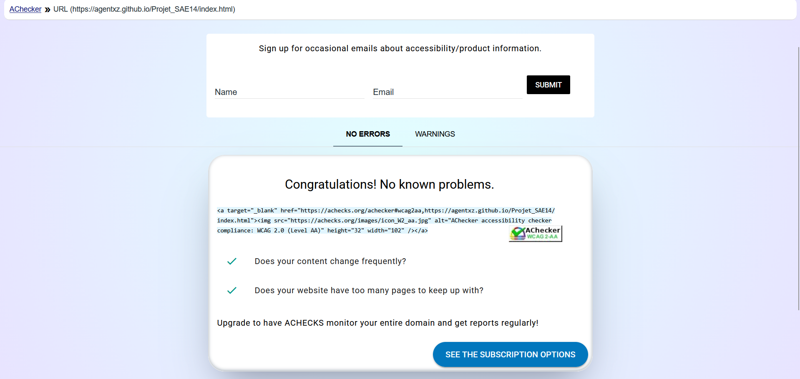

# 🃏 BlackJack — SAE 14

Projet web en HTML/CSS présentant les règles du BlackJack. Réalisé dans le cadre de la SAE 14 (BUT R&T).

## 🚀 Démo
- https://agentxz.github.io/Projet_SAE14/

## 🗂️ Pages
- 🏠 `index.html` — Accueil et navigation
- 📘 `rules.html` — Règles, valeurs des cartes, déroulement d'une partie
- 👤 `about.html` — À propos de l’auteur et liens

## ✨ Fonctionnalités
- 🎨 Thème sombre avec accents verts (variables CSS)
- 🧩 Layouts en CSS Grid et Flexbox
- 📱 Responsive (mobile, tablette, ordinateur)
- 🌀 Animations/transitions CSS (slideDown, fadeInUp, slideInLeft)
- 🖼️ Icônes via Font Awesome

## ⚙️ Installation locale
```bash
git clone https://github.com/AgentXZ/Projet_SAE14.git
cd Projet_SAE14
```
Ouvrir `index.html` dans le navigateur (ou utiliser Live Server).

## 🧭 Structure du dépôt
```
Projet_SAE14/
├── index.html
├── rules.html
├── about.html
├── css/
│   └── style.css
├── Gestion de projet/
│
└── README.md
```

## 🛠️ Stack
- HTML5
- CSS3 (variables, Grid, Flexbox, media queries, animations)
- Font Awesome
- Git / GitHub

## 🎨 Design & UX
- Navigation claire avec en‑tête commun
- Cartes et sections structurées (Grid/Flex)
- Dégradés, ombres et micro‑interactions

## 📱 Responsive
- Mobile ≤ 767px
- Tablette 768–1023px
- Desktop ≥ 1024px

## ♿ Accessibilité
- Langue des pages : `fr`
- Couleurs et contrastes adaptés au thème sombre

## ✅ Captures de validations
- ✅ Validation HTML

- ✅ Validation CSS

- ✅ Validation WCAG 2.0 AA

- ✅ Validation Wave Accessibility


## 🚢 Déploiement
- GitHub Pages (branche `master`) — https://agentxz.github.io/Projet_SAE14/

## 👤 Auteur
Albin Herbelin — albin.herbelin@etu.unicaen.fr — https://github.com/AgentXZ
